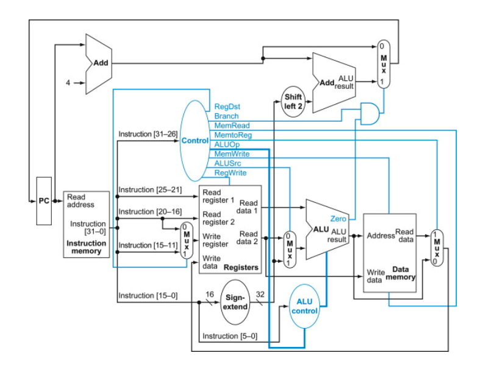

# CS3650_Single_Cycle_MIPS32

## Parts of the Processor Datapath: 
> Instruction Memory: 
> - A memory unit to store the instructions of a program and supply instructions given an address.
> - The instruction memory need only provide read access because the datapath does not write instructions. Since the instruction memory only reads, we treat it as combinational logic: the output at any time reflects the contents of the location specified by the address input, and no read control signal is needed.
> - We can load instruction memory using readmemh function from a mem file.

> Program Counter (PC):
> - The register containing the address of the next instruction in the program to be executed.
> - We use an adder to increment the PC to the address of the next instruction (PC + 4). This adder, which is combinational, can be built from the ALU.
> - The program counter is a 32-bit register that is written at the end of every clock cycle and thus does not need a write control signal. Because the address is incremented at every clock cycle, it will be a D Flip-Flop.

> Register File:
> - The processor's 32 general-purpose registers are stored in a structure called a register file. A register file is a collection of registers in which any register can be read or written by specifying the number of the register in the file. The register file contains the register state of the computer. In addition, we will need an ALU to operate on the values read from the registers.
> - R-format instructions have three register operands, so we will need to read two data words from the register file and write one data word into the register file for each instruction.
> - For each data word to be read from the registers, we need an input to the register file that specifies the register number to be read and an output from the register file that will carry the value that has been read from the registers. To write a data word, we will need two inputs: one to specify the register number to be written and one to supply the data to be written into the register. The register file always outputs the contents of whatever register numbers are on the Read register inputs. Writes, however, are controlled by the write control signal, which must be asserted for a write to occur at the clock edge.
> - We need a total of four inputs (three for register numbers and one for data) and two outputs (both for data). The register number inputs are 5 bits wide to specify one of 32 registers (32 = 25), whereas the data input and two data output buses are each 32 bits wide.
> - We load register memory using readmemh function from a memory file.

> ALU
> - For our processor, we will need to perform the following operations: add, subtract, and, or, nor, less than (for SLT).

> Sign Extension Unit:
> - Unit to sign-extend the 16-bit offset field in the instruction to a 32-bit signed value.
> - Given **lw $t1, offset_value($t2)** or **sw $t1, offset_value($t2)**, the offset is a signed 16-bit value.

> Data Memory:
> - The memory unit is a state element with inputs for the address and the write data, and a single output for the read result. There are separate read and write controls, although only one of these may be asserted on any given clock.
> - Given **lw $t1, offset_value($t2)** or **sw $t1, offset_value($t2)**, these instructions compute a memory address by adding the base register, which is $t2, to the 16-bit signed offset field contained in the instruction. If the instruction is a store, the value to be stored will be read from the register file in $t1. If the instruction is a load, the value read from memory must be written into the register file in $t1. Thus, we need both the register file and the ALU. We need a unit to sign-extend the 16-bit offset field in the instruction to a 32-bit signed value, and a data memory unit to read from or write to. The data memory must be written on store instructions; hence, data memory has read and write control signals, an address input, and an input for the data to be written into memory.
> - We load data memory using readmemh function.

> Shifter:
> - The beq instruction has three operands, two registers that are compared for equality, and a 16-bit offset used to compute the branch target address relative to the branch instruction address. 
> - Its form is **beq $t1, $t2, offset**. To implement this instruction, we must compute the branch target address by adding the sign-extended offset field of the instruction to the PC. The base for the branch address calculation is the address of the instruction following the branch (PC+4).  The offset field is shifted left 2 bits so that it is a word offset (shift the offset field by 2).
> - We must also determine whether the next instruction is the instruction that follows sequentially or the instruction at the branch target address. When the condition is true (i.e., the operands are equal), the branch target address becomes the new PC. If the operands are not equal, the incremented PC should replace the current PC.

## Operation of the Datapath

>> The control unit is that part of the processor which generates control signals in order to operate in the desired way depending on the instruction.

> **add $t1, $t2, $t3**
>> - The instruction is fetched, and the PC is incremented.
>> - Two registers, $t2 and $t3, are read from the register file; also, the main control unit computes the setting of the control lines during this step.
>> - The ALU operates on the data read from the register file, using the function code (bits 5:0, which is the funct field, of the instruction) to generate the ALU function.
>> - The result from the ALU is written into the register file using bits 15:11 of the instruction to select the destination register ($t1).

> **lw $t1, offset($t2)**
>> - An instruction is fetched from the instruction memory, and the PC is incremented.
>> - A register ($t2) value is read from the register file.
>> - The ALU computes the sum of the value read from the register file and the sign-extended, lower 16 bits of the instruction (offset).
>> - The sum from the ALU is used as the address for the data memory.
>> - The data from the memory unit is written into the register file; the register destination is given by bits 20:16 of the instruction ($t1).

> **beq $t1, $t2, offset**
>> - An instruction is fetched from the instruction memory, and the PC is incremented.
>> - A register ($t2) value is read from the register file.
>> - The ALU computes the sum of the value read from the register file and the sign-extended, lower 16 bits of the instruction (offset).
>> - The sum from the ALU is used as the address for the data memory.
>> - The data from the memory unit is written into the register file; the register destination is given by bits 20:16 of the instruction ($t1).

## Simulating the Processor
> Given the following MIPS instructions with 11 stored in $t1 and 22 stored in $t2:
>> 00: add $t1, $t2, $t3        
>> 04: lw $t1, $t2, 16'd4
>> 08: beq $t1, $t2, offset
>> 0C: add $t1, $t2, $t3
>> 10: or $t2, $t3, $t4
>> 14: sw $t1, $t2, offset

